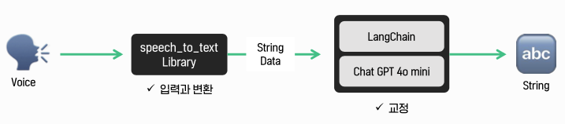

# 2024 2 VSA Anticlimax T11
## 소개
### 프로젝트 설명
대한민국은 빠르게 고령화 사회로 진입하고 있다. 통계청에 따르면 2017년부터 노인 인구가 급격히 증가하기 시작했으며, 고령화 지수는 지속적으로 상승하고 있다. 50대에서 60대의 시니어들은 사회에서 비교적 경제적 여유가 있지만, 건강 관리에 있어서는 디지털 기기 사용의 어려움이나 정보 과부하로 인해 제대로 된 도움을 받지 못하는 경우가 많다. 

이를 위해 아래와 같은 두 가지 문제를 해결한다.

첫 번째, 이들이 겪는 주요 문제는 만성 질환의 관리, 특히 고혈압, 당뇨와 같은 질병에 대한 복약 관리가 어렵다는 점이다. 약 복용 시점을 놓치거나 복약 스케줄을 잘못 이해하는 경우가 많으며, 이에 따른 건강 악화 문제가 자주 발생한다.

두 번째, 또한, 인터넷 상에서 제공되는 건강 정보는 많지만, 시니어들이 해당 정보를 선별하여 신뢰할 수 있는 자료를 찾는 것이 어려운 현실이다. 정보가 지나치게 많거나, 광고성 콘텐츠로 가득 찬 정보들은 시니어들이 올바른 결정을 내리는 데 방해가 된다.

 

### 기술 스택
| **Category** | **Stack** |
|:-----------:|:----------:|
| **FrontEnd** | `TypeScript`, `Dart`, `React`, `Next.js`, `Flutter` |
| **BackEnd** | `Java 17`, `Python`, `Spring`, `Django`, `LangChain`, `MySQL`, `Redis` |
| **DevOps** | `Git Action`, `Docker`, `NCP` |

 

### 팀원
| **Name** | **Position** |
|:--------:|:------------:|
| **서희찬** | `Frontend` |
| **윤창섭** | `Frontend` |
| **손형준** | `Backend` |

  

## 주요 기능

- **복약 관리 기능**: 사용자가 약봉투의 사진을 찍으면 OCR(광학 문자 인식) 기술을 통해 약 정보를 자동으로 등록하고, 복약 일정을 관리할 수 있는 기능을 제공한다. 이 기능은 시니어들이 복잡한 과정을 거치지 않고도 간편하게 약 정보를 관리할 수 있도록 하며, 복약 시간을 아침, 점심, 저녁, 혹은 데일리 스케줄에 맞춰 알림을 제공해 복약 누락을 방지한다.

- **건강 정보 제공 기능**: 전문가가 작성한 신뢰성 있는 건강 칼럼을 제공하여, 시니어들이 건강 관련 정보를 쉽게 얻을 수 있도록 한다. 또한 사용자 간의 정보 공유 커뮤니티를 형성하여, 건강 관리에 있어 상호 간의 도움을 주고받을 수 있는 환경을 제공한다. LLM(대형 언어 모델)을 활용하여, 사용자가 건강 관련 질문을 올리면 전문가가 답변하거나, 간단한 질문은 AI가 즉각 답변을 제공한다.

- **노화로 인한 신체 능력 감소 해결**: TTS(텍스트 음성 변환) 기능을 사용하여 시니어들이 텍스트 정보를 음성으로 들을 수 있게 하며, STT(음성 텍스트 변환) 기능을 통해 음성을 문서로 변환하여 시니어들이 음성 명령을 통해 정보를 쉽게 전달할 수 있도록 지원한다.

- **간편한 접근성**: 앱뿐만 아니라 웹 서비스까지 구축하여 다양한 환경에서 손쉽게 서비스를 이용할 수 있도록 하고, 검색 엔진 최적화(SEO)를 적극 도입해 필요한 정보를 빠르게 검색·접근할 수 있도록 지원한다.

 

## 개발 과정

### 핵심 기능 설계

**목소리 들어주기**

**목소리 들어주기**

**목소리 들어주기**

  

### 클라우드 아키텍처
해당 프로젝트틑 다음과 같이 구성되어 있다.

 

### Branch Naming Convention
| Commit Type | Description  |
|-------------|--------------|
| main        | 테스트 완료 후 배포용 |
| release     | QA/A/B 테스트용    |
| develop     | 개발 커밋 통합용    |
| feat        | 기능 개발용       |
| fix         | 버그 수정용       |
| refactor    | 코드 리팩토링      |

 

### Commit Convention
| Commit Type | Description |
| --- | --- |
| feat | Add new features |
| fix | Fix bugs |
| docs | Modify documentation |
| style | Code formatting, missing semicolons, no changes to the code itself |
| refactor | Code refactoring |
| test | Add test code, refactor test code |
| chore | Modify package manager, and other miscellaneous changes (e.g., .gitignore) |
| design | Change user UI design, such as CSS |
| comment | Add or modify necessary comments |
| rename | Only changes to file or folder names or locations |
| remove | Only performing the action of deleting files |

 

### PR Convention
| Icon | Code                       | Description                       |
|------|----------------------------|-----------------------------------|
| 🎨   | :art                       | Improve code structure/formatting |
| ⚡️   | :zap                       | Performance improvement           |
| 🔥   | :fire                      | Delete code/files                 |
| 🐛   | :bug                       | Fix bugs                          |
| 🚑   | :ambulance                 | Urgent fixes                      |
| ✨    | :sparkles                  | Introduce new features            |
| 💄   | :lipstick                  | Add/modify UI/style files         |